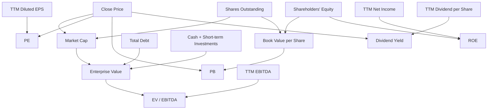

# Financial Dependency Graph

The full executable graph is
[`config/dependency-graph.json`](../config/dependency-graph.json). All graph
edges carry a point-in-time rule: financial facts must have been public at the
valuation date.
